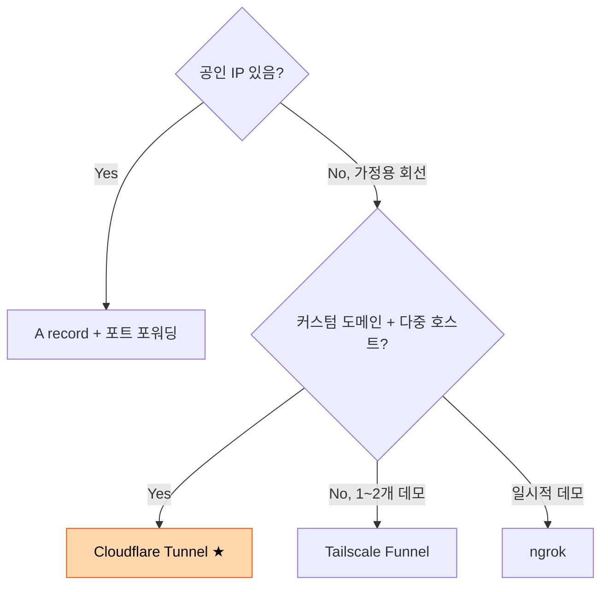

# 대안 비교

홈 서버를 외부에 노출하는 다른 방법들. 왜 Cloudflare Tunnel을 선택했는지 비교.

## 비교 매트릭스

| 방법 | 동적 IP 대응 | 포트 포워딩 | 공인 IP 노출 | TLS | 비용 |
|---|---|---|---|---|---|
| **Cloudflare Tunnel** ★현재 | 필요 없음 (outbound) | X | X | 자동 (CF) | 무료 |
| DuckDNS + 포트 포워딩 | 클라이언트가 IP 갱신 | O (80/443) | O | 직접 (Let's Encrypt 등) | 무료 |
| Tailscale Funnel | 필요 없음 | X | X | 자동 (TS) | 무료 (제한적) |
| ngrok | 필요 없음 | X | X | 자동 | 유료 (커스텀 도메인) |
| 공인 IP (B2B 회선) | 필요 없음 (고정) | O | O | 직접 | 비싼 회선비 |

---

## DuckDNS — 왜 안 썼나

**DuckDNS는 무엇인가:**

도메인(`yourname.duckdns.org`)을 ISP가 부여한 가정용 회선의 공인 IP에 동적으로 매핑해주는 무료 DDNS 서비스. ISP가 IP를 바꾸면 클라이언트(cron이나 ddclient)가 새 IP를 DuckDNS에 통보 → DNS 업데이트.

**DuckDNS가 의미 있으려면 동시에 필요한 것들:**

1. 공유기에서 80/443 포트를 Mac mini로 포워딩
2. Mac mini에 직접 nginx/Caddy로 TLS 종단 (Let's Encrypt 발급/갱신)
3. 방화벽 규칙
4. 가정용 회선의 ISP가 inbound 80/443을 허용해야 함 (한국 일부 ISP는 차단)

**Cloudflare Tunnel이 한 번에 해결:**

- 공인 IP가 바뀌어도 cloudflared가 outbound 연결을 유지하므로 DNS 갱신 불필요
- 포트 포워딩 불필요 — 외부에서 Mac mini로 들어오는 연결이 0개
- TLS는 Cloudflare 엣지에서 종단 — 내부는 평문 HTTP만 처리하면 됨
- 공인 IP 노출 0 → DDoS·스캔 위협 회피
- ISP 정책 우회

**결론:** DuckDNS는 "포트 포워딩이 가능한 환경에서 도메인이 동적 IP를 따라가게 하는" 도구. 우리 셋업은 애초에 포트 포워딩을 안 하므로 적용 대상 자체가 다름.

---

## 직접 포트 포워딩 (DuckDNS 없이도)

**셋업:**

1. 공유기에서 외부 80/443 → Mac mini로 포워딩
2. Mac mini에 nginx + Let's Encrypt
3. 도메인 A record를 공인 IP로 직접 지정

**문제점:**

- IP 바뀌면 DNS 수동 갱신 (또는 DDNS 필요)
- 공유기 펌웨어/UPnP/CGNAT 환경에서 문제 발생 흔함
- ISP의 가정용 회선 약관 위반 가능성
- DDoS 직격탄
- 인증서 갱신 직접 관리

---

## Tailscale Funnel

**무엇인가:** Tailscale이 제공하는 "내 노드를 외부 인터넷에 공개하기" 기능. Tailscale 네트워크가 외부 트래픽을 받아서 내 노드로 forward.

**Cloudflare Tunnel과의 비교:**

| 항목 | Tailscale Funnel | Cloudflare Tunnel |
|---|---|---|
| 무료 호스트 수 | 3개 노드 | 무제한 |
| 호스트네임 형태 | `<node>.<tailnet>.ts.net` | 본인 도메인 자유롭게 |
| 커스텀 도메인 | 추가 셋업 필요 (CNAME) | 기본 지원 |
| TLS | Tailscale이 발급 | Cloudflare가 발급 |
| WAF / 캐싱 | X | O |

작은 데모 1~2개라면 Tailscale Funnel도 좋은 선택. 도메인 4개 + 호스트 11개 + 캐싱이 필요한 우리 케이스는 Cloudflare Tunnel이 더 자연스러움.

---

## ngrok

**무엇인가:** 개발/데모용 임시 터널 서비스의 원조. 무료 플랜은 URL이 매번 바뀜.

**왜 안 맞나:**

- 커스텀 도메인 사용은 유료 ($20/월~)
- 본인 도메인 안정 운영보다는 일시적 데모 용도
- 트래픽 한도 있음

---

## 결론

11개 호스트 + 4개 도메인 + 무료 무제한 + 자체 발급 SSL + IP 노출 X — 이 조합을 가장 깔끔하게 충족하는 게 Cloudflare Tunnel이라서 선택.
