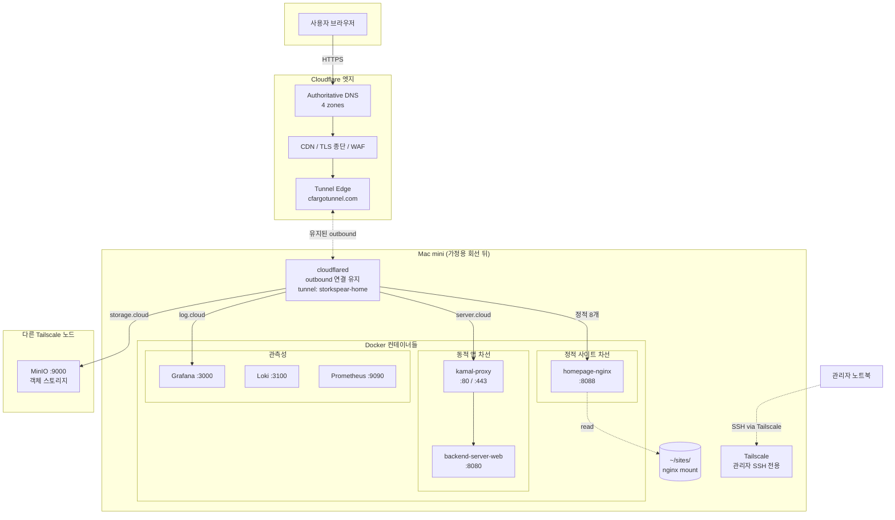
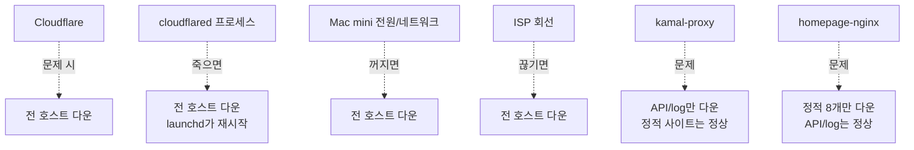

# 인프라 아키텍처

전체 시스템 구성도. 사용자 브라우저부터 Mac mini의 컨테이너까지 어떻게 연결되는지.

## 전체 구성도

## 핵심 컴포넌트

### Cloudflare 엣지

- **Authoritative DNS:** 4개 zone (`storkspear.cloud`, `storkspear.co.kr`, `seoseji.site`, `moojigae.co.kr`). 11개 호스트 모두 `<tunnel-id>.cfargotunnel.com`을 가리키는 CNAME (proxied=true).
- **CDN / TLS 종단:** 모든 외부 트래픽은 Cloudflare에서 HTTPS 종단. Universal SSL 자동 발급.
- **Tunnel Edge:** Mac mini에서 들어오는 outbound 연결을 유지하고, 요청이 들어오면 그 연결로 되돌려 보냄.

### Mac mini (집)

- **cloudflared:** 단일 프로세스. CF로 항상 outbound 연결 유지. `~/.cloudflared/storkspear.yml`의 ingress 규칙대로 호스트별로 내부 컨테이너에 분기. launchd가 자동 재시작 관리.
- **Docker:**
    - `kamal-proxy` — Basecamp의 Kamal과 함께 쓰는 무중단 배포용 리버스 프록시. 새 컨테이너 띄워서 트래픽 swap.
    - `backend-server-web` — 실제 API 앱. `ghcr.io/storkspear/backend-server` 이미지.
    - `homepage-nginx` — 단순 정적 서빙 + www → apex 리다이렉트. nginx:alpine.
    - `grafana / loki / prometheus` — 관측성 스택.
- **`~/sites/`:** 정적 파일 마운트. `hello/`(placeholder 4개) + `portfolio/`(git clone). nginx가 read-only로 마운트.
- **Tailscale:** 관리자(노트북)에서 SSH 접속용. 외부 트래픽 라우팅에는 사용 안 함.

### 다른 노드

- **MinIO:** 객체 스토리지. Mac mini와 별도 머신, Tailscale로만 접근. cloudflared가 storage.storkspear.cloud 요청을 Tailscale IP로 직접 forward.

## 의존 그래프 (단일 장애점)

대부분의 일상적 작업(API 배포, 정적 사이트 업데이트)은 마지막 두 박스에 해당해서 영향 범위가 격리돼있음.
