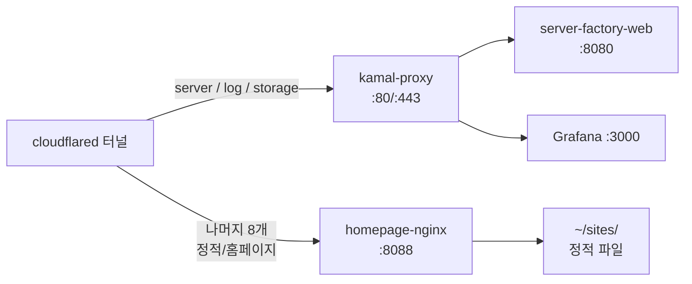

# 서빙 중인 DNS

Mac mini가 cloudflared 터널을 통해 직접/간접적으로 응답하는 호스트네임 전체 목록.

총 **4개 도메인 · 11개 호스트네임**.

---

## :material-server-network: storkspear.cloud — 백엔드 서비스

| 호스트 | 라우팅 대상 | 용도 |
|---|---|---|
| `server.storkspear.cloud` | `kamal-proxy` (:80/:443) → `server-factory-web` (:8080) | API 백엔드 |
| `log.storkspear.cloud` | Grafana (:3000) | 로그/메트릭 대시보드 |
| `storage.storkspear.cloud` | MinIO (다른 Tailscale 노드) | S3 호환 객체 스토리지 |

---

## :material-web: seoseji.site — 정적 사이트

| 호스트 | 콘텐츠 |
|---|---|
| `seoseji.site` | placeholder (hello world) |
| `www.seoseji.site` | → 301 redirect → `seoseji.site` |
| `portfolio.seoseji.site` | 편집디자이너 포트폴리오 사이트 |

---

## :material-web: storkspear.co.kr — 정적 사이트

| 호스트 | 콘텐츠 |
|---|---|
| `storkspear.co.kr` | placeholder (hello world) |
| `www.storkspear.co.kr` | → 301 redirect → `storkspear.co.kr` |

---

## :material-web: moojigae.co.kr — 정적 사이트

| 호스트 | 콘텐츠 |
|---|---|
| `moojigae.co.kr` | placeholder (hello world) |
| `www.moojigae.co.kr` | → 301 redirect → `moojigae.co.kr` |
| `dev.moojigae.co.kr` | placeholder (hello world, 개발 환경 예약) |

---

## 처리 분기

호스트네임은 cloudflared의 ingress 규칙에 따라 두 가지 컨테이너로 분기됩니다:

- **kamal-proxy 경로:** 무중단 배포가 필요한 동적 앱
- **nginx 경로:** 단순 정적 서빙 + www → apex 리다이렉트

!!! tip "장애 격리"
    `server.storkspear.cloud`(API)가 배포 중 잠깐 내려가도 나머지 8개 정적 호스트는 영향 없음. 컨테이너가 분리돼있어서.
