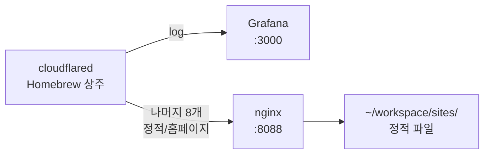

# 서빙 중인 DNS

Mac mini가 cloudflared 터널을 통해 직접/간접적으로 응답하는 호스트네임 전체 목록.

총 **4개 도메인 · 9개 호스트네임**.

---

## :material-server-network: storkspear.cloud — 백엔드 서비스

서빙 중인 건 `log` 하나입니다. 나머지 서브도메인은 template-spring 기반 API 서버에 쓰려고
발급해 둔 **예약 상태**로, 아직 DNS 레코드도 터널 ingress도 잡혀 있지 않습니다.

| 호스트 | 라우팅 대상 | 용도 |
|---|---|---|
| `log.storkspear.cloud` | Grafana (:3000) 직결 | 로그/메트릭 대시보드 · Cloudflare Access 보호 |

---

## :material-web: seoseji.site — 정적 사이트

| 호스트 | 콘텐츠 |
|---|---|
| `seoseji.site` | placeholder (hello world) |
| `www.seoseji.site` | → 301 redirect → `seoseji.site` |
| `portfolio.seoseji.site` | 편집디자이너 포트폴리오 사이트 |

---

## :material-web: storkspear.co.kr — 정적 사이트

| 호스트 | 콘텐츠 |
|---|---|
| `storkspear.co.kr` | placeholder (hello world) |
| `www.storkspear.co.kr` | → 301 redirect → `storkspear.co.kr` |

---

## :material-web: moojigae.co.kr — 정적 사이트

| 호스트 | 콘텐츠 |
|---|---|
| `moojigae.co.kr` | placeholder (hello world) |
| `www.moojigae.co.kr` | → 301 redirect → `moojigae.co.kr` |
| `dev.moojigae.co.kr` | placeholder (hello world, 개발 환경 예약) |

---

## 처리 분기

cloudflared는 Homebrew 상주 프로세스로 돌면서, 호스트네임을 ingress 규칙에 따라 두 갈래로 넘깁니다:

```mermaid
flowchart LR
  CF[cloudflared<br/>Homebrew 상주] -->|log| GRAFANA[Grafana<br/>:3000]
  CF -->|나머지 8개<br/>정적/홈페이지| NGINX[nginx<br/>:8088]
  NGINX --> SITES[~/workspace/sites/<br/>정적 파일]
```

- **Grafana 경로:** `log` 하나. Cloudflare Access가 앞단에서 인증을 요구합니다.
- **nginx 경로:** 단순 정적 서빙 + www → apex 리다이렉트.
  ingress에 없는 Host는 터널 catch-all이, vhost에 없는 Host는 nginx `default_server`가 각각 404로 끊습니다.

!!! tip "장애 격리"
    Grafana(:3000)가 내려가도 나머지 8개 정적 호스트는 영향 없음. 프로세스가 분리돼있어서.
