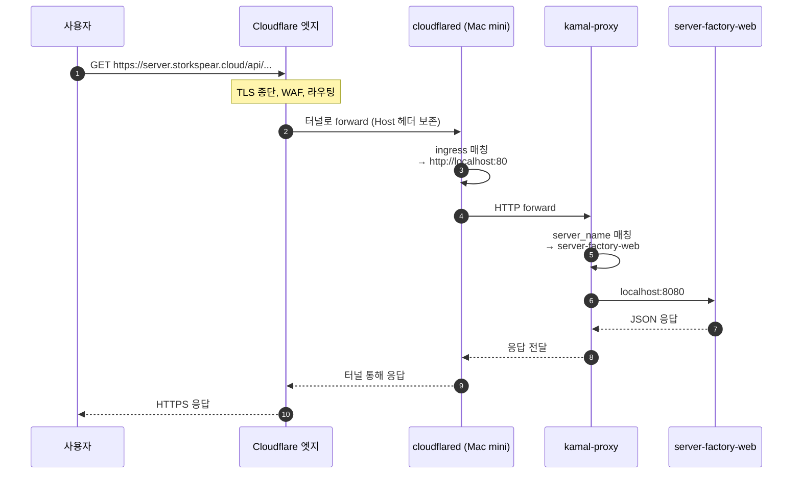
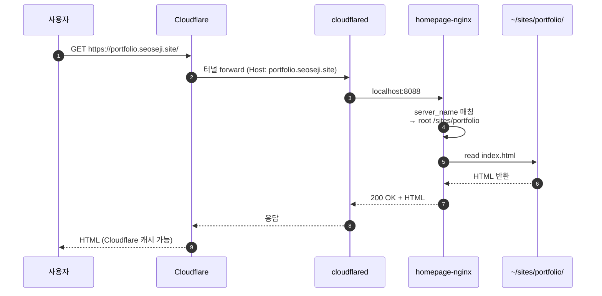
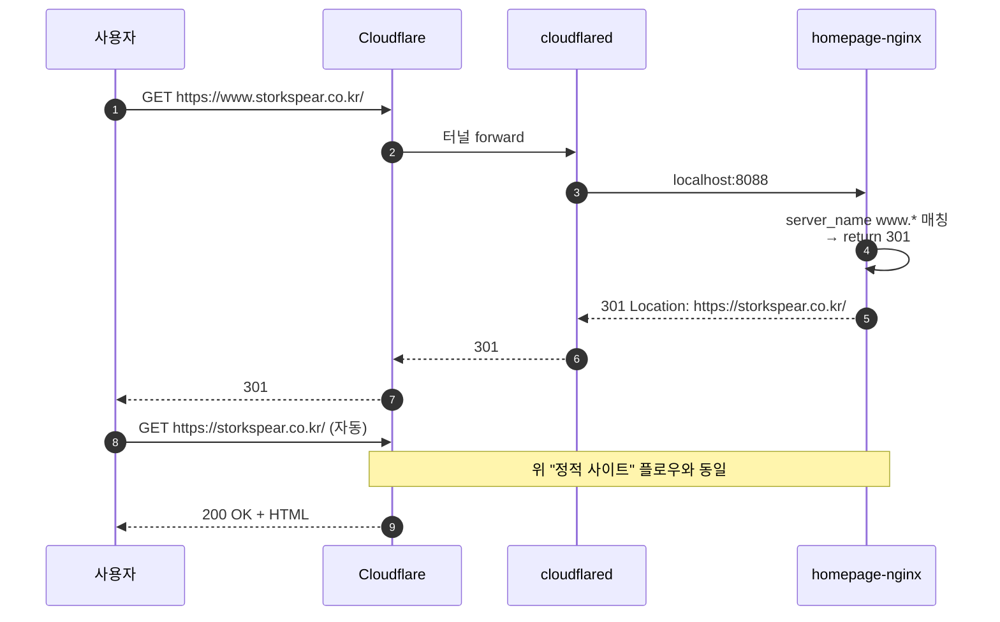
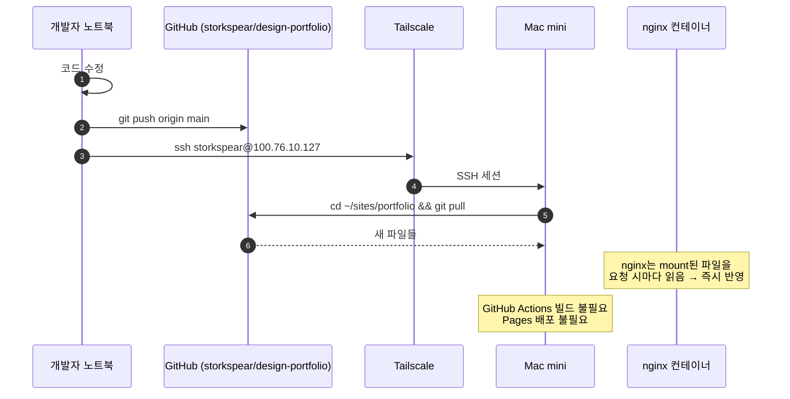
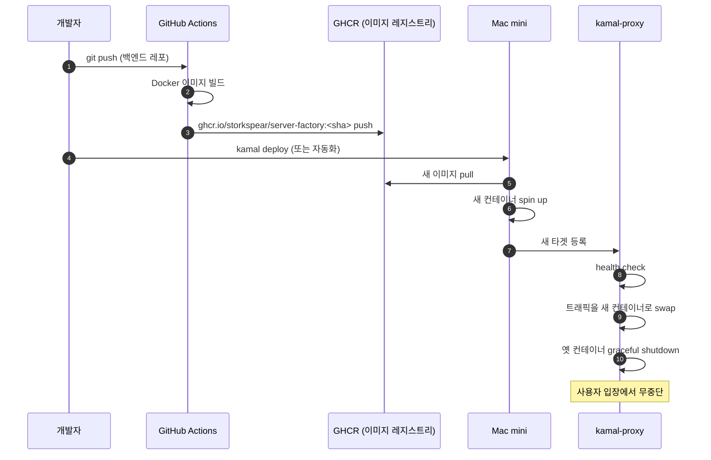
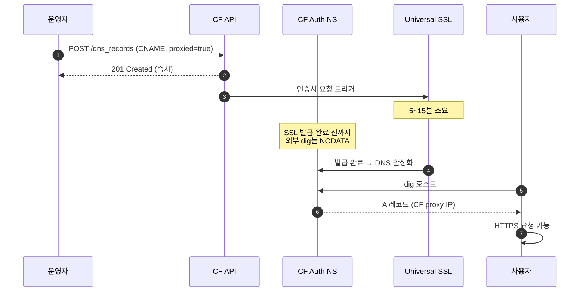

# 요청 처리 플로우

호스트네임 종류별로 요청이 어떻게 흘러가는지 시퀀스 다이어그램으로 정리.

## 1. API 요청 (`server.storkspear.cloud`)

핵심: Cloudflare에서 TLS 종단 후 평문 HTTP로 터널을 통과 → 내부에서도 평문 HTTP로 컨테이너 간 통신. 외부에는 HTTPS로 보임.

---

## 2. 정적 사이트 요청 (`portfolio.seoseji.site`)

호스트별로 다른 `root` 디렉토리를 가지므로, 같은 nginx 컨테이너가 사이트마다 다른 콘텐츠를 서빙.

---

## 3. www → apex 리다이렉트 (`www.storkspear.co.kr`)

브라우저 두 번 요청. 사용자 경험상 자연스럽고 SEO 일관성도 확보됨.

---

## 4. 배포 플로우 — 정적 사이트 (`portfolio.seoseji.site`)

이 플로우 덕분에 GitHub Actions 사용량과 무관하게 무한 배포 가능.

---

## 5. 배포 플로우 — 백엔드 (`server.storkspear.cloud`)

Kamal의 핵심: 옛 컨테이너에 요청 처리 끝나기를 기다린 뒤 종료 → 1초도 안 끊김.

---

## 6. www DNS 추가 시 SSL 발급 흐름 (운영 팁)

새로 추가한 proxied 호스트가 외부에 안 보이면 90% 이 발급 대기 때문.
