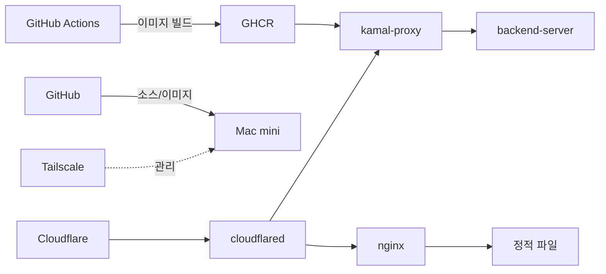

# 기술 스택

각 컴포넌트가 어떤 역할을 하고 왜 선택됐는지.

## :material-cloud: Cloudflare DNS + Tunnel

**역할:** 외부 진입점, DNS, TLS 종단, DDoS 보호, **터널을 통한 outbound 연결로 IP 노출 회피**.

**왜 선택됐나:**

- 가정용 회선의 동적 IP / NAT / 방화벽을 무력화 (outbound 연결로 우회)
- 무료 Universal SSL — 인증서 발급/갱신 자동
- 한 터널로 무제한 호스트네임 라우팅
- 공유기 포트 포워딩 불필요, 공인 IP 노출 없음

**핵심 파일:** `~/.cloudflared/storkspear.yml` (ingress 규칙)

---

## :material-shield-network: Tailscale

**역할:** 관리자 노트북 → Mac mini SSH 접속 (관리 트래픽 전용).

**왜 선택됐나:**

- 외부 SSH 포트 노출 불필요 — Mac mini에 22번이 열려있지 않음
- 100.x.x.x mesh IP로 어디서든 접근 (카페, 회사, 본가)
- 사용자 트래픽(웹) 라우팅에는 사용 안 함 — Cloudflare Tunnel이 그 역할

---

## :material-docker: Docker (Docker Desktop for Mac)

**역할:** 컨테이너 런타임. 모든 서비스가 컨테이너로 격리됨.

**현재 컨테이너:**

| 컨테이너 | 이미지 | 역할 |
|---|---|---|
| `kamal-proxy` | `basecamp/kamal-proxy:v0.9.2` | 무중단 배포용 리버스 프록시 |
| `backend-server-web-...` | `ghcr.io/storkspear/backend-server:<sha>` | API 백엔드 |
| `homepage-nginx` | `nginx:alpine` | 정적 사이트 + www 리다이렉트 |
| `observability-grafana` | `grafana/grafana:11.3.0` | 메트릭/로그 대시보드 |
| `observability-loki` | `grafana/loki:3.2.0` | 로그 저장소 |
| `observability-prometheus` | `prom/prometheus:v2.55.0` | 메트릭 수집 |

---

## :material-rocket-launch: Kamal

**역할:** Rails/Docker 앱 무중단 배포 도구 (Basecamp 제작).

**왜 선택됐나:**

- 명령어 한 줄로 빌드 → 푸시 → 새 컨테이너 → 트래픽 swap → 옛 컨테이너 종료
- `kamal-proxy`가 자체 헬스체크 후 트래픽 라우팅
- Kubernetes 없이도 단일 머신에서 production-grade 배포 가능

---

## :material-application: nginx (alpine)

**역할:** 정적 사이트 서빙 + www→apex 리다이렉트.

**구성:** 단일 컨테이너 `homepage-nginx`가 8088 포트로 listen. `server_name`별 가상 호스트로 11개 사이트 중 8개를 처리.

**왜 selected:**

- HTTP/1.1 가상 호스트만으로 충분한 라우팅 (포트 분리 불필요)
- alpine 이미지가 가벼움 (~50MB)
- mount만 갱신해도 즉시 반영 — 재시작 불필요

---

## :material-github: GitHub + Actions + Pages

**역할:** 소스 호스팅, CI/CD, Pages를 통한 일부 정적 사이트 호스팅.

**현재 활용:**

- `storkspear/design-portfolio` — 포트폴리오 사이트 소스. Mac mini가 git pull로 가져감.
- `storkspear/storkspear-homeserver-infra-docs-viewer` (이 문서) — Actions로 mkdocs 빌드 → Pages 배포.

**Actions 사용량 절약 전략:**

- 정적 사이트 업데이트는 Mac mini에서 `git pull`로 처리 (Actions 안 씀)
- Pages 배포가 꼭 필요한 경우만 Actions 사용

---

## :material-database: MinIO

**역할:** S3 호환 객체 스토리지. Mac mini와 별도 머신에서 운영.

**접근:** Tailscale 사설 IP를 통해 Mac mini의 cloudflared가 forward → 외부에서는 `storage.storkspear.cloud`로 접근.

---

## :material-monitor-dashboard: Grafana / Loki / Prometheus

**역할:** 관측성 (Observability) — 메트릭/로그/대시보드.

**접근:** `log.storkspear.cloud`로 외부 접근 가능 (Grafana UI). 로그/메트릭은 docker-compose로 같이 관리.

---

## 의존도 정리

CF는 외부의존, 그 외는 모두 self-host 또는 push 방식 (의존도가 낮은 방향으로 흐름).
